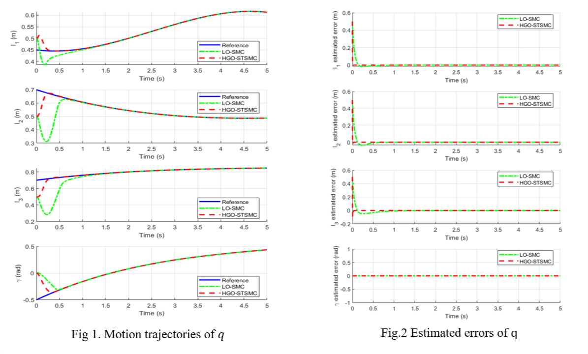

# parallel_robot_SSMC_HG

## Introduction

This contains all MATLAB/Simulink file for implementation of Super-twisting sliding mode controller and high-gain observer for a Car simulator system, which is instroduced in our paper ["High-Gain Observer-Based Super-Twisting Sliding Mode Control for Car Driving Simulator Systems"](https://ieeexplore.ieee.org/document/9989305)

## Results

